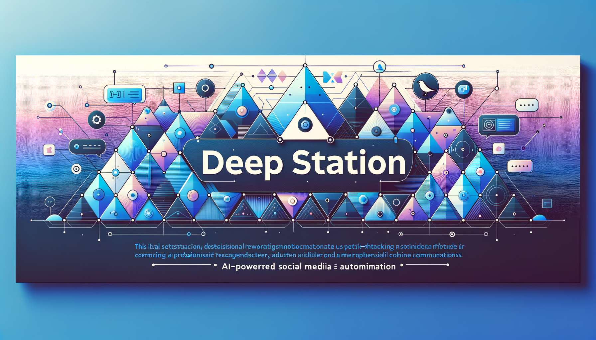

# Social Media Images Guide

Create stunning visual assets for your DeepStation repository to maximize engagement on social media platforms.

## 🎨 Required Images

### 1. Hero Image (README Banner)
- **Dimensions**: 1200×400px or 1200×600px
- **Format**: PNG or JPG
- **Location**: `docs/images/hero.png`
- **Purpose**: Top banner in README.md

### 2. Open Graph Image (Social Preview)
- **Dimensions**: 1200×630px
- **Format**: PNG or JPG
- **Location**: `public/og-image.png`
- **Purpose**: Social media previews (Twitter, LinkedIn, Facebook)

### 3. Repository Social Preview (GitHub)
- **Dimensions**: 1280×640px
- **Format**: PNG or JPG
- **Setup**: GitHub Settings → Social Preview → Upload Image
- **Purpose**: GitHub repository previews

## 🛠️ Quick Creation Options

### Option 1: Canva (Easiest)
1. Go to [Canva.com](https://canva.com)
2. Use templates:
   - Search "GitHub README Banner" (1200×400)
   - Search "Twitter Post" for OG image (1200×630)
3. Customize with:
   - **Title**: DeepStation
   - **Subtitle**: AI-Powered Social Media Automation
   - **Icons**: LinkedIn, Instagram, X, Discord logos
   - **Colors**: Brand colors (e.g., #6366f1, #8b5cf6)
   - **Background**: Gradient or tech-themed
4. Download as PNG

### Option 2: Figma (Design Custom)
1. Create new design with dimensions above
2. Design elements:
   - Clean, modern aesthetic
   - Show platform logos
   - Include key value props
   - Add subtle animations or gradients
3. Export as PNG

### Option 3: AI-Generated (Fast)
Use DALL-E, Midjourney, or similar:

**Prompt example:**
```
"Professional banner for a social media automation platform called DeepStation,
modern gradient background in blue and purple, with icons for LinkedIn, Instagram,
Twitter/X, and Discord, clean minimalist design, 1200x400 pixels"
```

### Option 4: Code-Based (HTML + Screenshot)
Create a simple HTML file with styling and screenshot it.

## 📐 Design Guidelines

### Hero Image Best Practices
- **Clarity**: Easy to read at small sizes
- **Branding**: Include logo or name
- **Value Prop**: What does DeepStation do?
- **Visual Interest**: Gradients, icons, or illustrations
- **Contrast**: Text should be highly readable

### OG Image Best Practices
- **Text Size**: Large enough for mobile previews
- **Safe Zone**: Keep important content in center 1200×600
- **Platform Logos**: Show LinkedIn, Instagram, X, Discord
- **Call to Action**: "Automate Your Social Media" or similar

## 🎨 Design Templates

### Template 1: Gradient Banner
```
Background: Linear gradient (blue #6366f1 to purple #8b5cf6)
Title: "DeepStation" (72px, bold, white)
Subtitle: "AI-Powered Social Media Automation" (32px, white 80% opacity)
Icons: Platform logos in white (48px each)
```

### Template 2: Tech Theme
```
Background: Dark (#0f172a) with subtle grid pattern
Title: "DeepStation" (64px, bold, white)
Tagline: "Post Once, Publish Everywhere" (28px, accent color)
Elements: Floating platform icons with glow effects
```

### Template 3: Clean Professional
```
Background: White with subtle gradient
Title: "DeepStation" (56px, bold, dark)
Subtitle: "Open-Source Social Media Automation" (24px, gray)
Visual: Dashboard mockup or interface preview
Accent: Brand color border or highlight
```

## 📱 Preview & Validate

### Test Your Images
1. **Twitter Card Validator**: https://cards-dev.twitter.com/validator
2. **LinkedIn Post Inspector**: https://www.linkedin.com/post-inspector/
3. **Facebook Sharing Debugger**: https://developers.facebook.com/tools/debug/

### GitHub Repository Setup
1. Go to repository Settings
2. Scroll to "Social preview"
3. Click "Edit"
4. Upload your 1280×640 image
5. Save

## 🖼️ Example Assets to Include

### Hero Image Should Show:
- ✅ Project name
- ✅ Tagline
- ✅ Platform logos (LinkedIn, Instagram, X, Discord)
- ✅ Visual identity (colors, style)

### OG Image Should Show:
- ✅ Large, readable title
- ✅ Brief description
- ✅ Visual element (screenshot, illustration)
- ✅ GitHub URL or call to action

## 🎯 Quick Canva Setup

1. Create account at canva.com (free)
2. Click "Create a design"
3. Enter custom dimensions: 1200 x 400
4. Choose template or start blank
5. Add elements:
   - Text: "DeepStation"
   - Text: "AI-Powered Social Media Automation"
   - Icons: Add platform logos from Elements
   - Background: Choose gradient or solid color
6. Download → PNG → Download
7. Repeat for 1200×630 OG image

## 🚀 Sample Color Schemes

### Tech Blue/Purple
```
Primary: #6366f1
Secondary: #8b5cf6
Background: #0f172a
Text: #ffffff
```

### Modern Gradient
```
Start: #667eea
End: #764ba2
Background: #1a202c
Text: #ffffff
```

### Clean Professional
```
Primary: #3b82f6
Secondary: #10b981
Background: #f8fafc
Text: #1e293b
```

## 📝 After Creating Images

1. Save images to `docs/images/` folder:
   - `hero.png` (1200×400)
   - `og-image.png` (1200×630)
   - `github-social.png` (1280×640)

2. Update README.md:
   ```markdown
   
   ```

3. Add to `next.config.js` or create `app/layout.tsx` metadata:
   ```typescript
   export const metadata = {
     openGraph: {
       images: ['/og-image.png'],
     },
     twitter: {
       images: ['/og-image.png'],
     },
   }
   ```

4. Upload to GitHub repository settings (Social Preview)

## 🎨 Need Help?

- Use **Canva** templates: Search "GitHub Banner" or "Social Media"
- Check out other popular open-source projects for inspiration
- Hire a designer on Fiverr ($5-20 for simple banners)
- Use AI tools like DALL-E or Midjourney

## ✨ Examples from Popular Projects

Check these for inspiration:
- Next.js: Clean, professional
- Supabase: Modern gradient style
- Tailwind CSS: Vibrant, colorful
- Vercel: Minimalist, high contrast

---

**Ready to create?** Start with Canva for the easiest experience! 🚀
